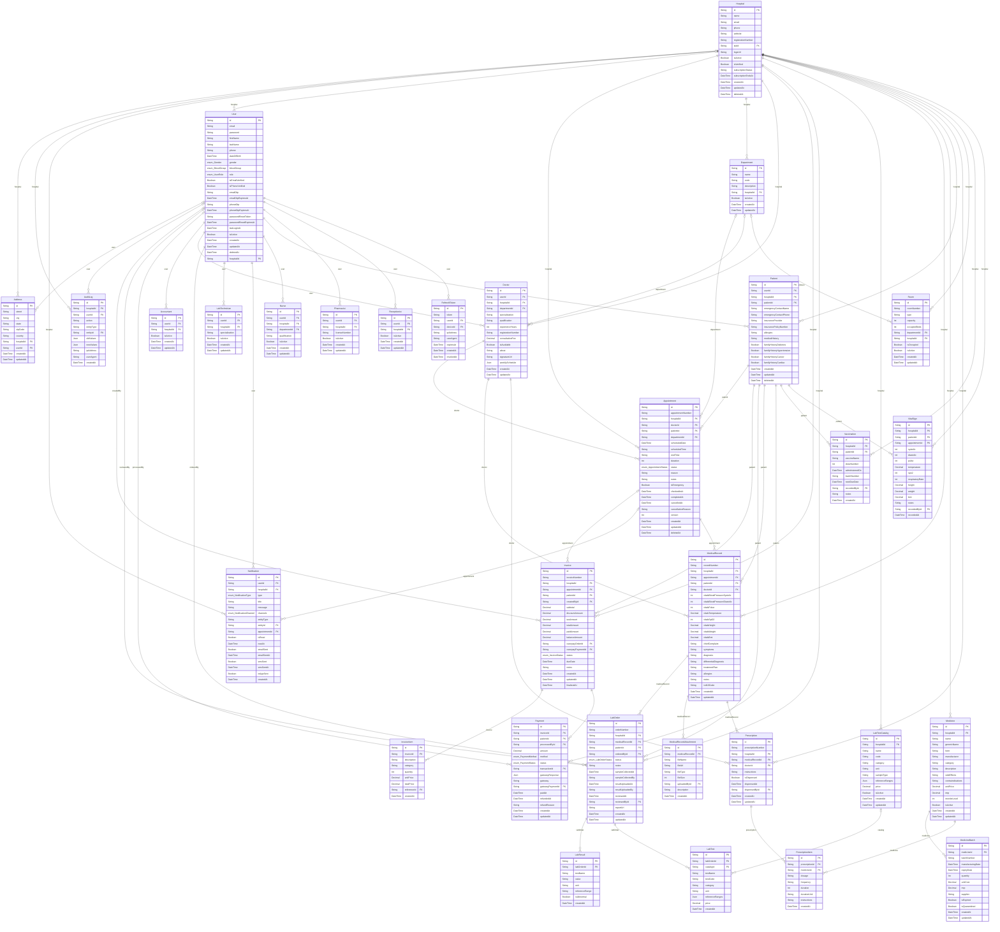

# MedCore HMS — ER Diagram

Generated from `apps/backend/prisma/schema.prisma` by `scripts/gen-docs.py`. 31 models, 10 enums. Renders on GitHub.

```mermaid
erDiagram
  Hospital {
    String id PK
    String name
    String email
    String phone
    String website
    String registrationNumber
    String taxId FK
    String logoUrl
    Boolean isActive
    Boolean isVerified
    String subscriptionStatus
    DateTime subscriptionEndsAt
    DateTime createdAt
    DateTime updatedAt
    DateTime deletedAt
  }
  Address {
    String id PK
    String street
    String city
    String state
    String zipCode
    String country
    String hospitalId FK
    String userId FK
    DateTime createdAt
    DateTime updatedAt
  }
  User {
    String id PK
    String email
    String password
    String firstName
    String lastName
    String phone
    DateTime dateOfBirth
    enum_Gender gender
    enum_BloodGroup bloodGroup
    enum_UserRole role
    Boolean isEmailVerified
    Boolean isPhoneVerified
    String emailOtp
    DateTime emailOtpExpiresAt
    String phoneOtp
    DateTime phoneOtpExpiresAt
    String passwordResetToken
    DateTime passwordResetExpiresAt
    DateTime lastLoginAt
    Boolean isActive
    DateTime createdAt
    DateTime updatedAt
    DateTime deletedAt
    String hospitalId FK
  }
  RefreshToken {
    String id PK
    String token
    String userId FK
    String deviceId FK
    String ipAddress
    String userAgent
    DateTime expiresAt
    DateTime createdAt
    DateTime revokedAt
  }
  Doctor {
    String id PK
    String userId FK
    String hospitalId FK
    String departmentId FK
    String specialization
    String qualification
    Int experienceYears
    String registrationNumber
    Decimal consultationFee
    Boolean isAvailable
    String about
    String signatureUrl
    Json weeklySchedule
    DateTime createdAt
    DateTime updatedAt
  }
  Patient {
    String id PK
    String userId FK
    String hospitalId FK
    String patientId FK
    String emergencyContactName
    String emergencyContactPhone
    String insuranceProvider
    String insurancePolicyNumber
    String allergies
    String medicalHistory
    Boolean familyHistoryDiabetes
    Boolean familyHistoryHypertension
    Boolean familyHistoryCancer
    Boolean familyHistoryCardiac
    DateTime createdAt
    DateTime updatedAt
    DateTime deletedAt
  }
  Nurse {
    String id PK
    String userId FK
    String hospitalId FK
    String departmentId FK
    String qualification
    Boolean isActive
    DateTime createdAt
    DateTime updatedAt
  }
  Receptionist {
    String id PK
    String userId FK
    String hospitalId FK
    Boolean isActive
    DateTime createdAt
    DateTime updatedAt
  }
  LabTechnician {
    String id PK
    String userId FK
    String hospitalId FK
    String specialization
    Boolean isActive
    DateTime createdAt
    DateTime updatedAt
  }
  Pharmacist {
    String id PK
    String userId FK
    String hospitalId FK
    String licenseNumber
    Boolean isActive
    DateTime createdAt
    DateTime updatedAt
  }
  Accountant {
    String id PK
    String userId FK
    String hospitalId FK
    Boolean isActive
    DateTime createdAt
    DateTime updatedAt
  }
  Department {
    String id PK
    String name
    String code
    String description
    String hospitalId FK
    Boolean isActive
    DateTime createdAt
    DateTime updatedAt
  }
  Room {
    String id PK
    String roomNumber
    String type
    Int capacity
    Int occupiedBeds
    String departmentId FK
    String hospitalId FK
    Boolean isOccupied
    Boolean isActive
    DateTime createdAt
    DateTime updatedAt
  }
  Appointment {
    String id PK
    String appointmentNumber
    String hospitalId FK
    String doctorId FK
    String patientId FK
    String departmentId FK
    DateTime scheduledDate
    String scheduledTime
    String endTime
    Int duration
    enum_AppointmentStatus status
    String reason
    String notes
    Boolean isEmergency
    DateTime checkedInAt
    DateTime completedAt
    DateTime cancelledAt
    String cancellationReason
    Int version
    DateTime createdAt
    DateTime updatedAt
    DateTime deletedAt
  }
  MedicalRecord {
    String id PK
    String recordNumber
    String hospitalId FK
    String appointmentId FK
    String patientId FK
    String doctorId FK
    Int vitalsBloodPressureSystolic
    Int vitalsBloodPressureDiastolic
    Int vitalsPulse
    Decimal vitalsTemperature
    Int vitalsSpO2
    Decimal vitalsHeight
    Decimal vitalsWeight
    Decimal vitalsBmi
    String chiefComplaint
    String symptoms
    String diagnosis
    String differentialDiagnosis
    String treatmentPlan
    String allergies
    String notes
    String icd10Code
    DateTime createdAt
    DateTime updatedAt
  }
  MedicalRecordAttachment {
    String id PK
    String medicalRecordId FK
    String fileName
    String fileUrl
    String fileType
    Int fileSize
    String uploadedById FK
    String description
    DateTime createdAt
  }
  Prescription {
    String id PK
    String prescriptionNumber
    String hospitalId FK
    String medicalRecordId FK
    String doctorId FK
    String instructions
    Boolean isDispensed
    DateTime dispensedAt
    String dispensedById FK
    DateTime createdAt
    DateTime updatedAt
  }
  PrescriptionItem {
    String id PK
    String prescriptionId FK
    String medicineId FK
    String dosage
    String frequency
    Int duration
    String durationUnit
    String instructions
    DateTime createdAt
  }
  LabTestCatalog {
    String id PK
    String hospitalId FK
    String name
    String code
    String category
    String unit
    String sampleType
    Json referenceRanges
    Decimal price
    Boolean isActive
    DateTime createdAt
    DateTime updatedAt
  }
  LabOrder {
    String id PK
    String orderNumber
    String hospitalId FK
    String medicalRecordId FK
    String patientId FK
    String orderedById FK
    enum_LabOrderStatus status
    String notes
    DateTime sampleCollectedAt
    String sampleCollectedBy
    DateTime resultUploadedAt
    String resultUploadedBy
    DateTime reviewedAt
    String reviewedById FK
    String reportUrl
    DateTime createdAt
    DateTime updatedAt
  }
  LabTest {
    String id PK
    String labOrderId FK
    String catalogId FK
    String testName
    String testCode
    String category
    String unit
    Json referenceRanges
    Decimal price
    DateTime createdAt
  }
  LabResult {
    String id PK
    String labOrderId FK
    String testName
    String value
    String unit
    String referenceRange
    Boolean isAbnormal
    DateTime createdAt
  }
  Medicine {
    String id PK
    String hospitalId FK
    String name
    String genericName
    String form
    String manufacturer
    String category
    String description
    String sideEffects
    String contraindications
    Decimal unitPrice
    Decimal mrp
    Int reorderLevel
    Boolean isActive
    DateTime createdAt
    DateTime updatedAt
  }
  MedicineBatch {
    String id PK
    String medicineId FK
    String batchNumber
    DateTime manufacturingDate
    DateTime expiryDate
    Int quantity
    Decimal unitCost
    Decimal mrp
    String supplier
    Boolean isExpired
    Boolean isQuarantined
    DateTime createdAt
    DateTime updatedAt
  }
  Invoice {
    String id PK
    String invoiceNumber
    String hospitalId FK
    String appointmentId FK
    String patientId FK
    String createdById FK
    Decimal subtotal
    Decimal discountAmount
    Decimal taxAmount
    Decimal totalAmount
    Decimal paidAmount
    Decimal balanceAmount
    String razorpayOrderId FK
    String razorpayPaymentId FK
    enum_InvoiceStatus status
    DateTime dueDate
    String notes
    DateTime createdAt
    DateTime updatedAt
    DateTime finalizedAt
  }
  InvoiceItem {
    String id PK
    String invoiceId FK
    String description
    String category
    Int quantity
    Decimal unitPrice
    Decimal totalPrice
    String referenceId FK
    DateTime createdAt
  }
  Payment {
    String id PK
    String invoiceId FK
    String patientId FK
    String processedById FK
    Decimal amount
    enum_PaymentMethod method
    enum_PaymentStatus status
    String transactionId FK
    Json gatewayResponse
    String gateway
    String gatewayPaymentId FK
    DateTime paidAt
    DateTime refundedAt
    String refundReason
    DateTime createdAt
    DateTime updatedAt
  }
  Notification {
    String id PK
    String userId FK
    String hospitalId FK
    enum_NotificationType type
    String title
    String message
    enum_NotificationChannel channels
    String entityType
    String entityId FK
    String appointmentId FK
    Boolean isRead
    DateTime readAt
    Boolean emailSent
    DateTime emailSentAt
    Boolean smsSent
    DateTime smsSentAt
    Boolean inAppSent
    DateTime createdAt
  }
  AuditLog {
    String id PK
    String hospitalId FK
    String userId FK
    String action
    String entityType
    String entityId FK
    Json oldValues
    Json newValues
    String ipAddress
    String userAgent
    DateTime createdAt
  }
  Vaccination {
    String id PK
    String hospitalId FK
    String patientId FK
    String vaccineName
    Int doseNumber
    DateTime administeredOn
    String batchNumber
    DateTime nextDueDate
    String recordedById FK
    String notes
    DateTime createdAt
  }
  VitalSign {
    String id PK
    String hospitalId FK
    String patientId FK
    String appointmentId FK
    Int systolic
    Int diastolic
    Int pulse
    Decimal temperature
    Int spo2
    Int respiratoryRate
    Decimal height
    Decimal weight
    Decimal bmi
    String notes
    String recordedById FK
    DateTime recordedAt
  }
  Appointment |o--o{ Invoice : "appointment"
  Appointment |o--o{ Notification : "appointment"
  Appointment ||--o{ MedicalRecord : "appointment"
  Department |o--o{ Appointment : "department"
  Department |o--o{ Doctor : "department"
  Department |o--o{ Room : "department"
  Doctor ||--o{ Appointment : "doctor"
  Doctor ||--o{ MedicalRecord : "doctor"
  Doctor ||--o{ Prescription : "doctor"
  Hospital |o--o{ Address : "hospital"
  Hospital |o--o{ AuditLog : "hospital"
  Hospital |o--o{ Notification : "hospital"
  Hospital |o--o{ User : "hospital"
  Hospital ||--o{ Appointment : "hospital"
  Hospital ||--o{ Department : "hospital"
  Hospital ||--o{ Doctor : "hospital"
  Hospital ||--o{ Invoice : "hospital"
  Hospital ||--o{ LabOrder : "hospital"
  Hospital ||--o{ LabTestCatalog : "hospital"
  Hospital ||--o{ MedicalRecord : "hospital"
  Hospital ||--o{ Medicine : "hospital"
  Hospital ||--o{ Patient : "hospital"
  Hospital ||--o{ Prescription : "hospital"
  Hospital ||--o{ Room : "hospital"
  Hospital ||--o{ Vaccination : "hospital"
  Hospital ||--o{ VitalSign : "hospital"
  Invoice ||--o{ InvoiceItem : "invoice"
  Invoice ||--o{ Payment : "invoice"
  LabOrder ||--o{ LabResult : "labOrder"
  LabOrder ||--o{ LabTest : "labOrder"
  LabTestCatalog |o--o{ LabTest : "catalog"
  MedicalRecord ||--o{ LabOrder : "medicalRecord"
  MedicalRecord ||--o{ MedicalRecordAttachment : "medicalRecord"
  MedicalRecord ||--o{ Prescription : "medicalRecord"
  Medicine ||--o{ MedicineBatch : "medicine"
  Medicine ||--o{ PrescriptionItem : "medicine"
  Patient ||--o{ Appointment : "patient"
  Patient ||--o{ Invoice : "patient"
  Patient ||--o{ LabOrder : "patient"
  Patient ||--o{ MedicalRecord : "patient"
  Patient ||--o{ Payment : "patient"
  Patient ||--o{ Vaccination : "patient"
  Patient ||--o{ VitalSign : "patient"
  Prescription ||--o{ PrescriptionItem : "prescription"
  User |o--o{ Address : "user"
  User |o--o{ AuditLog : "user"
  User |o--o{ Invoice : "createdBy"
  User |o--o{ LabOrder : "reviewedBy"
  User |o--o{ Payment : "processedBy"
  User ||--o{ Accountant : "user"
  User ||--o{ Doctor : "user"
  User ||--o{ LabOrder : "orderedBy"
  User ||--o{ LabTechnician : "user"
  User ||--o{ Notification : "user"
  User ||--o{ Nurse : "user"
  User ||--o{ Patient : "user"
  User ||--o{ Pharmacist : "user"
  User ||--o{ Receptionist : "user"
  User ||--o{ RefreshToken : "user"
```
